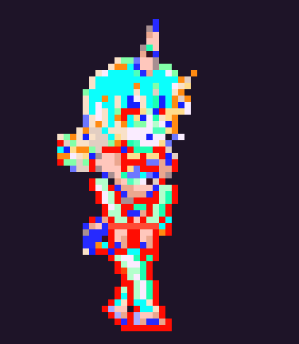

# sprite-forge

Turn any pixel-art image — real or AI-generated — into clean game sprites, new poses and animations that keep the character consistent. Built while re-posing and animating a character cut out of a single screenshot, and every mistake made along the way is now a rule in [`SKILL.md`](SKILL.md).

<p align="center">
  
  
  
</p>

What it does:

| step | tool | what it solves |
|---|---|---|
| **extract** | `spriteforge extract` | cuts the character out of a screenshot: background colour distance, largest component + attached bits, holes filled, nearby stars/coins dropped |
| **snap** | `spriteforge snap` | finds the *native* pixel grid of fake pixel art (AI output has none), takes the median per cell, quantises the palette → a real 1x sprite, sharper than the source |
| **dump** | `spriteforge dump` | prints the sprite as a palette-indexed ASCII map so edits are planned pixel-exact, never guessed |
| **re-pose** | `Sprite.erase / paint / restore_from` + `Limb` / `Pose` | remove limbs by exact ranges, restore what was underneath from the source, draw new limbs in the same palette, shading and view angle |
| **idle** | `idle_loop` | whole-body breathing with secondary motion (hair lag, hem flare, blink). No part-seams |
| **walk** | `walk_cycle` | legs drawn fresh per frame (contact → recoil → pass), personality via stride, hands, eye line |
| **showcase** | `showcase.render_walk / to_mp4` | back into the original scene at a slip-free ground speed |

## Install

```bash
git clone https://github.com/isabellagreco1997/sprite-forge
cd sprite-forge
pip install -r requirements.txt      # pillow numpy scipy
# ffmpeg on PATH for mp4 output (brew install ffmpeg)
```

## Quick start

```bash
python -m spriteforge.cli extract screenshot.png cut.png --region 530 185 790 470
python -m spriteforge.cli snap cut.png sprite_1x.png --colors 24
python -m spriteforge.cli dump sprite_1x.png > dump.txt        # read this, then edit
python -m spriteforge.cli scale sprite_1x.png sprite_8x.png --k 8
```

Then re-pose and animate in Python — see [`examples/girl/make_poses.py`](examples/girl/make_poses.py) for the full worked example (extract → standing pose → idle loops → shy walk → clip inside her own game screen):

```python
from spriteforge import Sprite, PROFILE_LEG, WALK_POSES, idle_loop, walk_cycle, export

sp = Sprite.load("sprite_1x.png")
print(sp.dump())                                  # plan the edit on the map
sp.erase_rows(37, 49)                             # take the old legs off
PROFILE_LEG.draw(sp, 14, WALK_POSES["STAND"])     # far leg
PROFILE_LEG.draw(sp, 17, WALK_POSES["STAND"])     # near leg
frames = idle_loop(sp, n=16, mode="stand", feet_row=44)
export.gif(frames, "idle.gif")
```

## Using it as a Claude Code skill

Copy or symlink this folder to `~/.claude/skills/sprite-forge` (or your project's `.claude/skills/`). `SKILL.md` carries the playbook: the order of checks, the seam rule, the slip-factor rule, and how to re-pose without losing the character. Claude will follow it when you ask for sprites, poses or animations.

## The rules, in one breath

1. **View angle first.** Match the body: a 3/4 torso needs overlapping profile legs.
2. **Measure the silhouette** before redrawing a part. No tubes.
3. **Same palette, same shading density.** Never simplify.
4. **Never slide parts past each other.** Move the whole body; secondary motion only where it physically happens.
5. **Restore, don't guess** what was under a removed limb.
6. **Draw walk frames, don't flip them.** Contact → recoil → pass.
7. **Slip factor = 1.0.** Ground speed comes from the stride.
8. **Feet on the measured floor.** Verify the final render, not the pipeline.

Full version with the why: [`SKILL.md`](SKILL.md) · history of every mistake: [`docs/LESSONS.md`](docs/LESSONS.md).

## Examples

* `examples/girl/` — from screenshot to standing pose, float and standing idle loops, a shy walk, and the clip back inside her game.
* `examples/knight/` — a knight drawn procedurally (parts as rectangles with per-frame offsets, auto-outline), 6-frame idle + walk, dungeon showcase. Useful when you need a sprite from nothing.

## License

MIT
