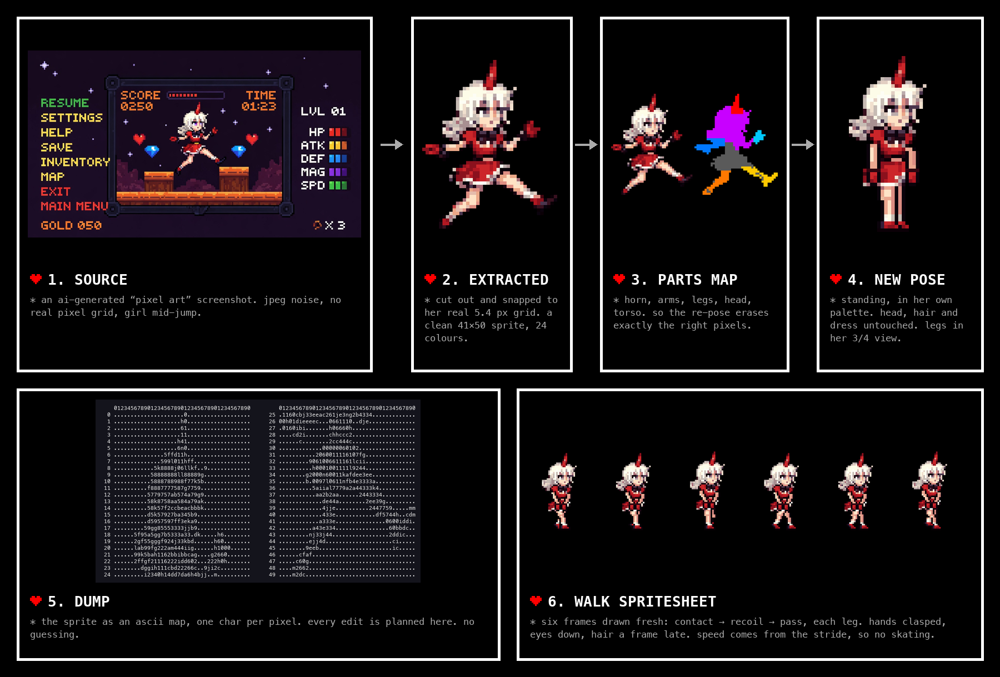

# sprite-forge

```
    isabella          LV 13          13:37
    * screenshot → sprite

      ❤ Continue
        Reset
```

<p align="center"></p>

<table align="center">
  <tr>
    <td align="center" width="50%" valign="top"><br><b>❤ 7. IDLE</b><br><sub>* whole body breathes. hair one beat behind, hem flares, she blinks. nothing gets cut.</sub></td>
    <td align="center" width="50%" valign="top"><br><b>❤ 8. WALK</b><br><sub>* shy shuffle. legs drawn fresh every frame, hands clasped, eyes down, hair a frame late.</sub></td>
  </tr>
</table>

```
* i had one ai-generated screenshot of a girl mid-jump.
* i wanted her standing on the platform. then walking.
* it took 13 rounds of me going "no, that's not it".
* every one of those rounds is now a rule in this repo.
```

so this is the toolkit that came out of it. give it any pixel-art image, real or ai-made, and it cuts the character out, finds her actual pixel grid, lets you re-pose her without losing who she is, and animates her without the cheap tricks. no sliding body parts, no flipped legs, no skating.

there's a `SKILL.md` in here too. if you use claude code, drop this folder into `~/.claude/skills/` and it reads the whole playbook before it touches a pixel. that's the point. the mistakes were paid for once.

---

```
      ❤ FIGHT        ACT        ITEM        MERCY
```

## ❤ FIGHT &nbsp;·&nbsp; get the sprite out

```bash
spriteforge extract screenshot.png cut.png --region 530 185 790 470
spriteforge snap cut.png sprite_1x.png --colors 24
spriteforge dump sprite_1x.png > dump.txt
spriteforge scale sprite_1x.png sprite_8x.png --k 8
```

* **extract** cuts her out of the screenshot. background colour distance, biggest blob plus anything attached to it, holes filled. stars and coins nearby get dropped.
* **snap** finds the *real* pixel grid. ai "pixel art" doesn't have one, it's noise that looks blocky. this brute-forces the cell size and phase, takes the median per cell and quantises. the result is sharper than what you started with.
* **dump** prints her as an ascii map, one character per pixel, palette-indexed. you plan every edit on this. no guessing.

## ❤ ACT &nbsp;·&nbsp; new pose, then move

```python
from spriteforge import Sprite, PROFILE_LEG, PROFILE_LEG_FAR, WALK_POSES, idle_loop, walk_cycle, export

sp = Sprite.load("sprite_1x.png")
print(sp.dump())                                   # * read the map first.
sp.erase_rows(37, 49)                              # * old legs off.
PROFILE_LEG_FAR.draw(sp, 17, WALK_POSES["STAND"])  # * far leg. behind, narrower.
PROFILE_LEG.draw(sp, 14, WALK_POSES["STAND"])      # * near leg. in front.
frames = idle_loop(sp, n=16, mode="stand", feet_row=44)
export.gif(frames, "idle.gif", bg=None)            # * true colours, transparent.
```

the full run is one script: [`examples/girl/make_poses.py`](examples/girl/make_poses.py). screenshot in. standing pose, idle, walk, and a clip of her walking around inside her own game screen out.

* **re-pose.** keep everything that doesn't move, pixel for pixel. erase limbs by exact rows from the dump. restore whatever was underneath from the source, don't repaint it from memory. draw the new limb in her palette, at her shading density, in her view angle.
* **idle.** move the whole body. secondary motion only where physics puts it: hair strands, a hem, a blink. a one pixel seam on a fifty pixel sprite reads as her being cut in half. ask me how i know.
* **walk.** legs drawn per frame, contact → recoil → pass. personality is in the stride, the hands and the eye line. ground speed comes from the stride, or she moonwalks.

## ❤ ITEM &nbsp;·&nbsp; install

```bash
git clone https://github.com/isabellagreco1997/sprite-forge
cd sprite-forge
pip install -e .          # pillow numpy scipy + the spriteforge command
brew install ffmpeg       # only for mp4 output
```

`python -m spriteforge.cli …` works without installing.

## ❤ MERCY &nbsp;·&nbsp; the rules

```
* You feel your sins crawling on your back.
```

1. **view angle first.** her torso is three-quarter, so her legs are three-quarter. overlapping, camera-side leg in front. i drew two front-facing legs under a turned body once. once.
2. **measure the silhouette** before you redraw anything. thigh, knee, calf, ankle. not a tube.
3. **same palette, same amount of shading.** simplifying is how you lose the character.
4. **never slide parts past each other.** the whole body moves. hair and hems lag.
5. **restore, don't guess** what was under a limb you removed.
6. **draw walk frames. don't flip them.**
7. **slip factor = 1.0.** if she moves further than her feet step, she's skating.
8. **feet on the measured floor.** check the final render, not the pipeline.

the long version with the why is [`SKILL.md`](SKILL.md). every round of "no, that's not it", what was actually wrong, and the rule it turned into, is [`docs/LESSONS.md`](docs/LESSONS.md).

---

```
* examples/girl    the whole sequence above, from one script.
* examples/knight  a knight drawn from nothing. rectangles, offsets, auto outline.
                   idle, walk, a dungeon. for when you have no source image.

* MIT. do what you want.
* stay determined.
```
