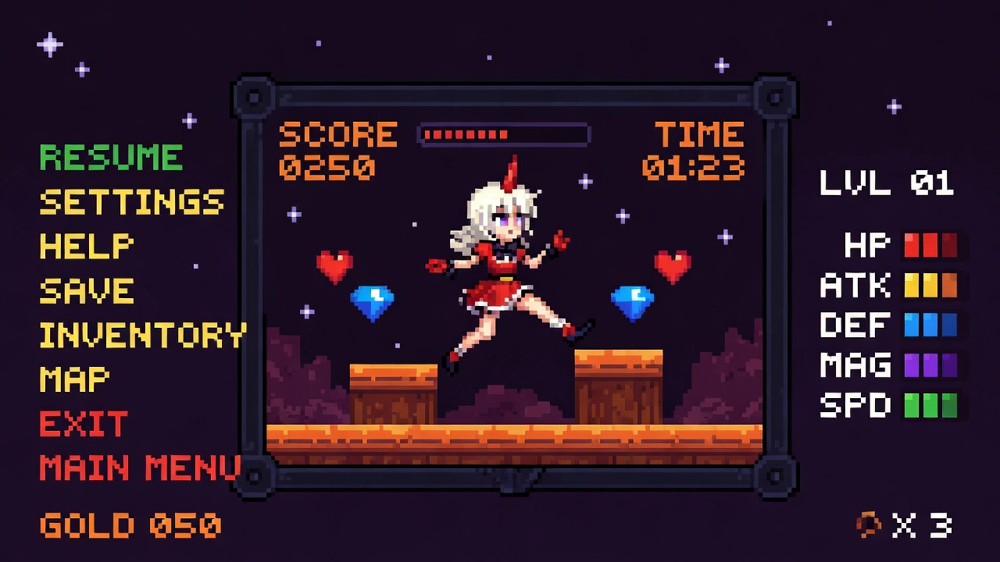
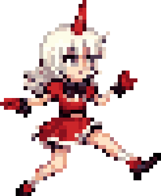
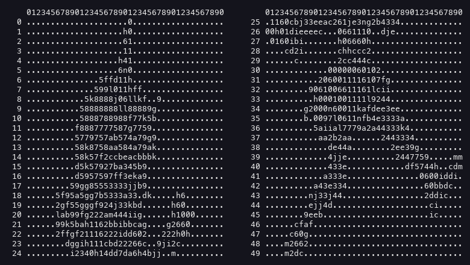
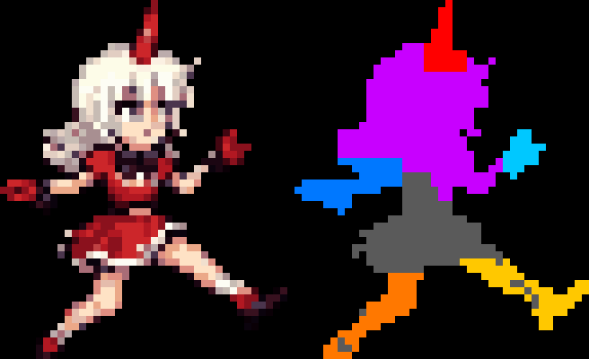
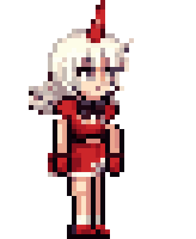
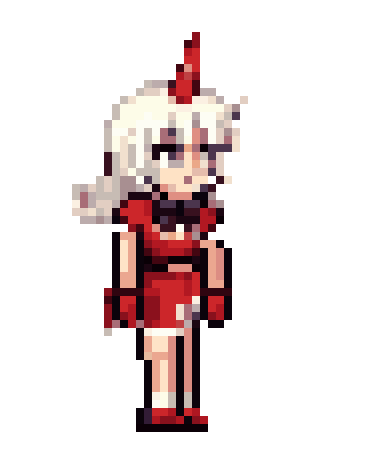
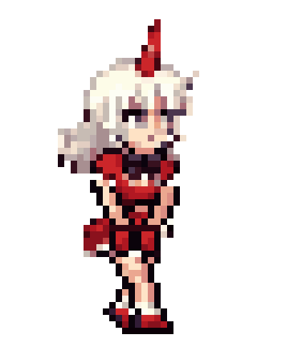

# sprite-forge

Turn any pixel-art image — real or AI-generated — into clean game sprites, new poses and animations that keep the character consistent. Built while re-posing and animating a character cut out of a single screenshot, and every mistake made along the way is now a rule in [`SKILL.md`](SKILL.md).

<table align="center">
  <tr>
    <td align="center" width="25%" valign="top"><br><b>1 · Source</b><br><sub>an AI-generated “pixel art” screenshot: noisy, no real pixel grid</sub></td>
    <td align="center" width="25%" valign="top"><br><b>2 · Extracted</b><br><sub>cut out and snapped to her native grid: a clean 41×50 sprite, 24 colours</sub></td>
    <td align="center" width="25%" valign="top"><br><b>3 · Dump</b><br><sub>the sprite as a palette-indexed ASCII map: every edit is planned here, row and column exact</sub></td>
    <td align="center" width="25%" valign="top"><br><b>4 · Parts map</b><br><sub>which pixels are horn, arms, legs, head, torso, so the re-pose erases exactly the right ones</sub></td>
  </tr>
  <tr>
    <td align="center" width="25%" valign="top"><br><b>5 · New pose</b><br><sub>standing idle drawn in her own palette; head, hair and dress untouched; legs in her three-quarter view</sub></td>
    <td align="center" width="50%" valign="top" colspan="2"><table width="100%"><tr><td align="center" width="50%"></td><td align="center" width="50%"></td></tr></table><b>6 · Idle loop &amp; walk cycle</b><br><sub>idle: whole-body breathing, hair lag, hem, blink, no seams · walk: shy shuffle, legs drawn fresh per frame, hands clasped, eyes down, hair a frame behind</sub></td>
    <td align="center" width="25%" valign="top"><br><b>7 · Spritesheet</b><br><sub>the six walk frames, contact → recoil → pass for both legs: what goes into the game</sub></td>
  </tr>
</table><b>7 · Walk cycle</b><br><sub>shy shuffle, legs drawn fresh per frame, hands clasped, eyes down, hair a frame behind; the six-frame spritesheet is what goes into the game: contact → recoil → pass, both legs</sub></td>
  </tr>
</table>

What it does:

| step | tool | what it solves |
|---|---|---|
| **extract** | `spriteforge extract` | cuts the character out of a screenshot: background colour distance, largest component + attached bits, holes filled, nearby stars/coins dropped |
| **snap** | `spriteforge snap` | finds the *native* pixel grid of fake pixel art (AI output has none), takes the median per cell, quantises the palette → a real 1x sprite, sharper than the source |
| **dump** | `spriteforge dump` | prints the sprite as a palette-indexed ASCII map so edits are planned pixel-exact, never guessed |
| **parts** | `parts.segment / preview` | polygon parts map (horn, arms, legs…) with priority and colour filters; the colour-coded preview shows the split before you erase |
| **re-pose** | `Sprite.erase / paint / restore_from` + `Limb` / `Pose` | remove limbs by exact ranges, restore what was underneath from the source, draw new limbs in the same palette, shading and view angle |
| **idle** | `idle_loop` | whole-body breathing with secondary motion (hair lag, hem flare, blink). No part-seams |
| **walk** | `walk_cycle` | legs drawn fresh per frame (contact → recoil → pass), personality via stride, hands, eye line |
| **showcase** | `showcase.render_walk / to_mp4` | back into the original scene at a slip-free ground speed |

## Install

```bash
git clone https://github.com/isabellagreco1997/sprite-forge
cd sprite-forge
pip install -e .                     # pillow numpy scipy + the `spriteforge` command
# ffmpeg on PATH for mp4 output (brew install ffmpeg)
```

## Quick start

```bash
spriteforge extract screenshot.png cut.png --region 530 185 790 470
spriteforge snap cut.png sprite_1x.png --colors 24
spriteforge dump sprite_1x.png > dump.txt        # read this, then edit
spriteforge scale sprite_1x.png sprite_8x.png --k 8
spriteforge gif frames_dir out.gif --ms 110      # any folder of frame PNGs → gif / spritesheet
```
(`python -m spriteforge.cli …` works without installing.)

Then re-pose and animate in Python — see [`examples/girl/make_poses.py`](examples/girl/make_poses.py) for the full worked example (extract → standing pose → idle loops → shy walk → clip inside her own game screen):

```python
from spriteforge import Sprite, PROFILE_LEG, PROFILE_LEG_FAR, WALK_POSES, idle_loop, walk_cycle, export

sp = Sprite.load("sprite_1x.png")
print(sp.dump())                                  # plan the edit on the map
sp.erase_rows(37, 49)                             # take the old legs off
PROFILE_LEG_FAR.draw(sp, 17, WALK_POSES["STAND"]) # far leg (her right, behind, narrower)
PROFILE_LEG.draw(sp, 14, WALK_POSES["STAND"])     # near leg (her left, in front)
frames = idle_loop(sp, n=16, mode="stand", feet_row=44)
export.gif(frames, "idle.gif")
```

## Using it as a Claude Code skill

Copy or symlink this folder to `~/.claude/skills/sprite-forge` (or your project's `.claude/skills/`). `SKILL.md` carries the playbook: the order of checks, the seam rule, the slip-factor rule, and how to re-pose without losing the character. Claude will follow it when you ask for sprites, poses or animations.

## The rules, in one breath

1. **View angle first.** Match the body: a 3/4 torso needs overlapping profile legs, and the camera-side leg is the near one (facing right → her left leg, screen-left, in front).
2. **Measure the silhouette** before redrawing a part. No tubes.
3. **Same palette, same shading density.** Never simplify.
4. **Never slide parts past each other.** Move the whole body; secondary motion only where it physically happens.
5. **Restore, don't guess** what was under a removed limb.
6. **Draw walk frames, don't flip them.** Contact → recoil → pass.
7. **Slip factor = 1.0.** Ground speed comes from the stride.
8. **Feet on the measured floor.** Verify the final render, not the pipeline.

Full version with the why: [`SKILL.md`](SKILL.md) · history of every mistake: [`docs/LESSONS.md`](docs/LESSONS.md).

## Examples

* `examples/girl/` — the sequence above, end to end, from one script: screenshot → extracted sprite → standing pose → float and standing idle loops → shy walk → a clip of her walking inside her own game screen (`out/girl_walking.mp4` after you run it).
* `examples/knight/` — a knight drawn procedurally (parts as rectangles with per-frame offsets, auto-outline), 6-frame idle + walk, dungeon showcase. Useful when you need a sprite from nothing.

## License

MIT
